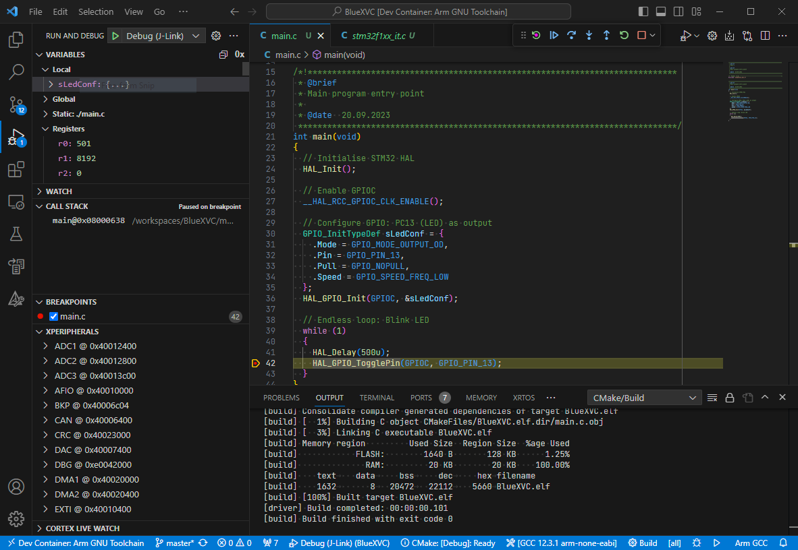

# armcm-devcontainer
   

*Arm Cortex-M development and debugging environment inside a VSCode devcontainer.*

### Packages
* [Microsoft .NET 6.0 Runtime](https://dotnet.microsoft.com/en-us/download/dotnet/6.0) Version 6.0.36
* [Arm GNU Toolchain](https://developer.arm.com/downloads/-/arm-gnu-toolchain-downloads) Version 14.2rel1
* [SEGGER J-Link Software](https://www.segger.com/downloads/jlink/) Version 8.14
* [xPack OpenOCD](https://github.com/xpack-dev-tools/openocd-xpack) Version 0.12.0-6
* [CMake](https://cmake.org/download) Version 3.31.5
## System Requirements
* VSCode [Dev Containers](https://marketplace.visualstudio.com/items?itemName=ms-vscode-remote.remote-containers) extension
* [usbipd-win](https://learn.microsoft.com/en-us/windows/wsl/connect-usb) (Windows *and* WSL parts installed!)

## Usage
* Include this repo as `.devcontainer` in the root of your project
* Connect debug probe
* Select `Dev Containers: Reopen in Container`

For CMake projects:
* Upon prompt, select the `Arm GNU Toolchain x.x` CMake Kit. 
  * The toolchain file is located at [`/opt/gcc-arm-none-eabi/gcc-arm-none-eabi.cmake`](gcc-arm-none-eabi.cmake).
  * The CMake kit definition for VS Code is located at [`/opt/devcontainer/cmake-tools-kits.json`](cmake-tools-kits.json).
* Run `CMake: Configure`
* Build using `CMake: Build [F7]`

### CMake+IntelliSense Notes
Upon first run, an error message may appear in Line 1, Column 1. Try re-running CMake configuration, or run a build. If the file is a `.h` header file, it needs to be `#include`'d into a C module.

### UDEV Rules installation
In order to use SEGGER and OpenOCD debug probes within the container, some udev rules need to be installed on the **host** machine. A setup script has been provided to aid with installation.
* Run `setup-devcontainer` inside the **container**
* Close the container, and re-open the work directory on your **host**
* Run the `install-rules` script inside `.vscode/setup/` on your host machine

      cd .vscode/setup
      sudo ./install-rules

### Serial Monitor
To access a serial port inside the devcontainer, use the `cu` command as shown below:

    cu -l <serial port device> -s <baudrate>

e.g. "`cu -l /dev/ttyACM0 -s 115200`".

To close the connection, press RETURN/ESC/Ctrl-C, type "`~.`" (tilde, dot) and wait for 3 seconds.

## Licensing

If not stated otherwise, the contents of this project are licensed under The MIT License. The full license text is provided in the [`LICENSE`](LICENSE) file.

    SPDX-License-Identifier: MIT